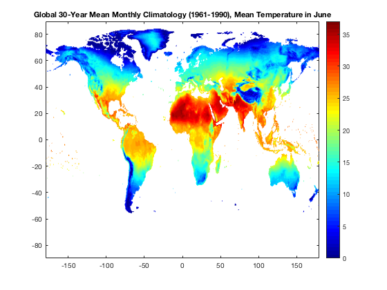

# Tutorial: Access Distributed NASA Earth Science Data from OPeNDAP Services using Matlab
*Author: ORNL DAAC*
 
*Date: April 10, 2018*
 
*Contact for [ORNL DAAC](https://daac.ornl.gov/): uso@daac.ornl.gov*

##### Keywords:  OPeNDAP, THREDDS, Matlab, temperature
## Overview
In this tutorial, we will explore how to use ORNL DAAC data from THREDDS Data Server through OPeNDAP protocol using Matlab. THREDDS is a web server that provides direct access to scientific data sets and OPeNDAP is a protocol that allows access to remote data without having to download the data. This example uses temporal subset of mean temperature in [global 30-year monthly climatology dataset](https://daac.ornl.gov/cgi-bin/dsviewer.pl?ds_id=542). The mean monthly temperature data is read and its attributes, dimensions and size are retrieved. A subset of mean temperature data in June is created and plotted.

## Source Data
Spatial subsets of 30-year(1961-1990) mean monthly surface climate over  global land areas, excluding Antarctica. In this example, monthly mean temperature climatology data is obtained from [this ORNL DAAC's THREDDS server](https://thredds.daac.ornl.gov/thredds/catalog/ornldaac/542/catalog.html?dataset=542/climate6190_TMP.nc4).  Get its OPeNDAP Data URL (https://thredds.daac.ornl.gov/thredds/dodsC/ornldaac/542/climate6190_TMP.nc4) from the OPeNDAP Dataset Access Form.   

## Prerequisites:
Matlab R2012a or later.

## Procedure
The Matlab live script can't be previewed in GitHub webpage. The tutorial below is in PDF version just for preview purpose. 
Access the tutorial here:  [Tutorial pdf](opendap_matlab_v1.pdf)

The R scripts are also accessible and downloadable. These two files are just in different format, but have the same contents. 
Access the Matlab scripts here: [Matlab Live Script in .mlx](opendap_matlab_v1.mlx), [Matlab script in .m](opendap_matlab_v1.m)

